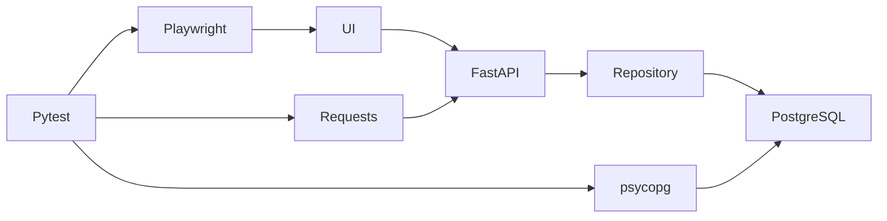

# Architecture

The controlled FastAPI app serves a static order form and REST endpoints. `OrderRepository` persists exact IDs through `Database`; PostgreSQL is the service runtime. The SQLite branch is limited to isolated repository tests and explicit focused UI development.

`OrderPage` submits browser fields and returns the creation response before result assertions. The test registers the returned ID with `OrderManager`, then validates the independent JSON contract, displayed values, API state, and SQL row. The manager owns teardown and attempts every registered ID. `ApiClient` retains structured exchange metadata, and `BrowserEvidence` observes errors without changing application behavior.

Compose starts PostgreSQL and the app with health checks. Host-side pytest uses explicit `APP_BASE_URL` and `DATABASE_URL`. `OrderFactory` adds run, worker, and random suffixes to records. Tests may run serially or with two workers because cleanup addresses only owned IDs. See the [README](../README.md) for commands and [test strategy](TEST_STRATEGY.md) for the assertion intent.
