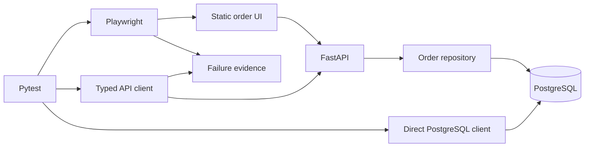

# Architecture

## Scope

This repository is a quality-engineering portfolio around one controlled order workflow.
The demo application provides owned UI, API, and persistence boundaries so the tests do
not depend on third-party websites. It is intentionally not a production product.

PostgreSQL is the primary database for service, integration, Docker, CI, and E2E
execution. SQLite has one narrow role: isolated checks and an explicitly enabled
lightweight UI-development path. It never substitutes for primary-stack validation.

## Runtime flow

The UI creates an order through the public API. API tests inspect REST behavior.
Database tests query the resulting row independently through psycopg. The complete E2E
case connects all three observations and then deletes only the order it owns.

## Component responsibilities

| Component | Responsibility | Boundary |
|---|---|---|
| `src/demo_app` | Serve a minimal UI/API and persist orders | No production auth, scaling, or cloud concerns |
| `Database` | Execute the small SQL surface through PostgreSQL or narrow SQLite adapter | PostgreSQL is the only integration runtime |
| `OrderRepository` | Create, read, and delete exact order IDs | No table-wide operations |
| `Settings` | Validate URLs, timeout, artifact root, and run ID | Does not read private context files |
| `ApiClient` | Provide time-bounded HTTP operations and body-free exchange metadata | Does not hide non-success responses |
| `PostgresOrderClient` | Verify persisted values independently | Read-only test queries by exact ID |
| `OrderFactory` | Generate unique run/worker-aware data | No shared mutable records |
| `OrderManager` | Track ownership and perform exact-record API cleanup | Never truncates or bulk-deletes |
| `OrderPage` | Encapsulate semantic browser interactions | No test-data or database responsibility |
| `BrowserEvidence` | Capture failure-relevant browser metadata | No cookies, headers, bodies, or environment dumps |

## Lifecycle

The Compose project defines:

- `database`: PostgreSQL 17.10 Bookworm with a health check and named volume
- `app`: a non-root Python 3.12 image that waits for database health and exposes its own
  health check

The app creates its small table at startup. The test runner stays on the host in the
current design, allowing the same locked Python environment and installed Playwright
browsers to exercise the Compose stack locally and in GitHub Actions.

The expected order is:

1. Install locked dependencies.
2. Start the Compose stack with `--wait`.
3. Poll `/health` with a bounded readiness helper.
4. Run service and browser tests.
5. Capture reports and Compose logs.
6. Stop the stack without deleting the database volume.

This lifecycle passed in the local no-cache Docker validation and in both the
pull-request and post-merge `main` GitHub Actions runs. Hosted jobs also captured
Compose diagnostics, stopped the stack, and uploaded the expected evidence.

## Data isolation and cleanup

Each factory payload includes a run identifier, xdist worker identifier, and random
suffix. State-changing tests register every created order ID. Fixture teardown deletes
only those IDs and checks that the API returns `404` afterward. Integration and E2E tests
also verify PostgreSQL absence when they delete within the test.

Serial execution is the default. Two-worker execution is an explicit proof after unique
data and targeted cleanup are in place.

## Configuration and privacy

Runtime values come from:

- `APP_BASE_URL`
- `DATABASE_URL`
- `API_TIMEOUT_SECONDS`
- `ARTIFACTS_DIR`
- `TEST_RUN_ID`

`.env.example` contains safe local demonstration values. Local environment variants,
private-note patterns, generated reports, virtual environments, caches, logs, browser
artifacts, and local database files are ignored. An explicit exception keeps
`.env.example` trackable. The Docker build context mirrors those safeguards and also
excludes Git metadata, tests, technical documentation, reports, and editor or operating
system state that the application image does not require.

## Deliberate exclusions

Kubernetes, Jenkins, Allure, public test websites, blanket retries, cloud deployment,
paid services, production authentication, performance testing, and production
observability are not part of this focused implementation. Their absence is a scope
decision, not evidence of expertise in those areas.
