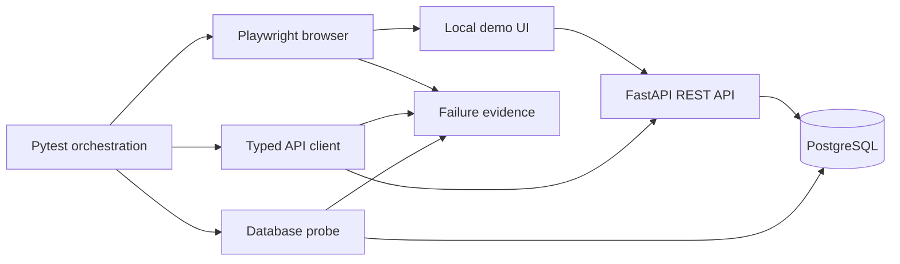

# Target Architecture

## Purpose

The target is a small, reproducible quality-engineering portfolio that proves—not merely
describes—Python, Pytest, Playwright, REST API testing, PostgreSQL validation,
integration testing, deterministic data, useful failure evidence, GitHub Actions, and
Docker Compose.

The demo application is intentionally small. Its purpose is to provide a controlled
system under test; the test architecture and engineering decisions remain the portfolio.

PostgreSQL is the primary persistent runtime for database, integration, E2E, Compose, and
CI evidence. SQLite may support isolated unit tests or a lightweight developer check, but
it is not an equal primary architecture and cannot support public database claims.

## Architecture principles

1. Every public capability claim has a repeatable validation command and retained evidence.
2. The system under test is local and controlled; core tests do not rely on public websites.
3. Test layers share configuration and data contracts but retain clear intent.
4. State-changing tests create unique data and guarantee targeted cleanup.
5. Serial execution must be reliable before parallel or retry behavior is introduced.
6. Retries are not enabled globally and never substitute for root-cause analysis.
7. Diagnostics explain the first failure through traces, screenshots, browser events,
   API evidence, database evidence, logs, and reports.
8. CI and local execution use the same named commands.
9. Infrastructure remains proportional: Docker Compose is useful; Kubernetes is not needed.
10. Documentation distinguishes implementation, demonstration, and future learning.

## Controlled system under test

Use one small order-workflow application:

- a minimal browser UI to create and view an order
- a REST API to create, read, and delete orders
- PostgreSQL persistence
- a health/readiness endpoint
- deterministic seed data only where necessary
- no production claim, cloud deployment, external account, or paid service

The application may use FastAPI to serve both the API and a minimal static HTML/JavaScript
UI. That keeps the application understandable and prevents application engineering from
overwhelming the test portfolio.



## Component boundaries

| Component | Responsibility | Explicit non-responsibility |
|---|---|---|
| Demo UI | Submit and display a small order workflow | Portfolio-grade frontend engineering |
| Demo API | Validate requests, expose CRUD endpoints, return stable contracts | Production authentication, scale, or cloud architecture |
| PostgreSQL | Persist orders and support direct validation | Production database administration |
| UI framework | Page/component objects, semantic locators, web assertions | Business data creation that is faster through the API |
| API framework | Session lifecycle, base URL, timeouts, redacted diagnostics, schema checks | Hiding HTTP failures or accepting broad status ranges |
| Database framework | Read-only verification queries and narrowly scoped cleanup helpers | Application migrations or destructive global cleanup |
| Test-data layer | Unique factories, worker-safe identifiers, cleanup registry | Shared mutable fixture records |
| Diagnostics layer | Failure-only browser evidence plus safe API/DB/log context | Capturing secrets or retaining noisy passing-test artifacts |
| Compose | Start app and database with health checks | Kubernetes-like orchestration |
| GitHub Actions | Run the same quality gates and publish evidence | Claiming production delivery infrastructure |

## Proposed directory structure

```text
sdet-playwright-framework/
├── .github/
│   └── workflows/
│       └── quality.yml
├── contracts/
│   └── order.schema.json
├── docs/
│   ├── REPOSITORY_AUDIT.md
│   ├── TARGET_ARCHITECTURE.md
│   ├── FRAMEWORK_MODERNIZATION_PLAN.md
│   ├── TEST_STRATEGY.md
│   └── TROUBLESHOOTING.md
├── scripts/
│   └── wait_for_services.py
├── src/
│   ├── demo_app/
│   │   ├── api/
│   │   ├── static/
│   │   ├── database.py
│   │   ├── main.py
│   │   ├── models.py
│   │   └── schemas.py
│   └── test_framework/
│       ├── api/
│       │   └── client.py
│       ├── db/
│       │   └── client.py
│       ├── pages/
│       │   └── orders_page.py
│       ├── config.py
│       ├── diagnostics.py
│       └── data_factory.py
├── tests/
│   ├── unit/
│   ├── api/
│   ├── contract/
│   ├── database/
│   ├── integration/
│   ├── ui/
│   └── e2e/
├── .dockerignore
├── .env.example
├── .gitignore
├── compose.yaml
├── conftest.py
├── Dockerfile
├── pyproject.toml
└── README.md
```

Empty category directories must not be added. Each directory appears only when its first
real test or implementation file is introduced.

## Tool choices

| Tool | Purpose | Why it is needed |
|---|---|---|
| Python 3.12 | Common application and test runtime | Matches the existing CI intent and has broad current package support |
| Pytest | Test discovery, fixtures, markers, reporting | Provides one runner across UI, API, database, integration, and E2E layers |
| pytest-playwright + Playwright | Browser lifecycle and UI automation | Provides reliable auto-waiting, browser projects, traces, screenshots, and video |
| Requests | External API test client | Familiar, explicit synchronous HTTP client suited to the current framework style |
| FastAPI + Uvicorn | Small controlled API and static UI host | Reuses Python and keeps the demo service intentionally small |
| Pydantic | Request/response validation inside the demo app | Creates explicit API contracts without hand-written validation |
| PostgreSQL | Owned persistent data for integration evidence | Enables a genuine API/database boundary and direct SQL verification |
| psycopg 3 | Test and application database access | Modern PostgreSQL driver with explicit transaction control |
| JSON Schema | Black-box response-contract validation | Keeps API tests independent of application model internals |
| pytest-xdist | Opt-in bounded parallel execution | Demonstrates isolation only after serial reliability is proven |
| Ruff | Linting and formatting | Replaces overlapping Flake8/Black configuration with one fast, deterministic gate |
| Mypy | Focused static type checking | Demonstrates typed framework interfaces and catches fixture/client contract drift |
| pytest-html and JUnit XML | Human and CI-readable test results | Avoids requiring Java/Allure CLI for the primary portfolio path |
| Docker + Docker Compose | Reproducible app/database orchestration | Provides one local and CI system-under-test lifecycle |
| GitHub Actions | Automated quality gates and artifact retention | Produces reviewable evidence using the public repository's native CI |

All dependencies must be bounded or locked. Exact versions should be selected and tested
during implementation rather than guessed in Phase 0.

## Pytest and browser lifecycle

- Do not redefine pytest-playwright's `page` fixture.
- Configure `base_url`, browser selection, tracing, screenshots, and video through supported
  plugin fixtures/options.
- Use function-scoped browser contexts for UI isolation.
- Keep browser process scope at the plugin default unless measured evidence justifies a
  change.
- Create a small autouse browser-diagnostics fixture that listens for:
  - browser console errors
  - uncaught page errors
  - failed requests
  - selected non-success API responses
- Attach failure evidence only after the test result is known.
- Keep artifacts in worker/test-specific directories and use node IDs safe for filenames.
- Capture traces and screenshots on first failure. Retain video only for selected E2E
  tests or failures if the plugin can do so reliably.
- Use Playwright `expect` assertions and semantic `get_by_role`, `get_by_label`, and
  `get_by_test_id` locators.

## Configuration

Use one immutable settings object populated from environment variables with safe local
defaults:

- `APP_BASE_URL`
- `API_BASE_URL`
- `DATABASE_URL`
- `API_TIMEOUT_SECONDS`
- `ARTIFACTS_DIR`
- `TEST_RUN_ID`

Rules:

- `.env.example` contains names and safe demo values only.
- A real `.env` remains ignored.
- Settings validation fails early with a useful message.
- URLs are injected into page objects and clients; they are never module constants in tests.
- Secrets, authorization headers, cookies, and passwords are redacted from diagnostics.
- No private local context file enters a package, Docker build context, report, or artifact.

## Test layers

| Layer | Purpose | Representative checks |
|---|---|---|
| Unit | Validate framework/app logic without services | currency conversion, settings validation, data factories, schema helpers |
| API | Black-box endpoint behavior | status, headers, body, errors, timeouts, CRUD |
| Contract | Validate stable JSON response shapes | create/read order schemas and negative response schema |
| Database | Verify persistence independently | inserted row values, timestamps, constraints, deletion |
| Integration | Validate API-to-database behavior without a browser | create by API, verify DB, delete, verify absence |
| UI | Validate focused browser behavior | form labels, validation, navigation, rendered order |
| E2E | Prove one complete business workflow | UI create, API read, DB verify, targeted cleanup |

Markers should reflect intent: `unit`, `api`, `contract`, `database`, `integration`, `ui`,
`e2e`, and `smoke`. No test should carry a duplicate marker.

## Complete UI-to-API-to-database workflow

1. A test factory generates a unique customer/order reference containing the run and worker
   identifier.
2. Playwright submits an order through the local UI.
3. The test observes the create-order network response and extracts the returned order ID.
4. A typed API client reads the order and validates status, headers, and JSON Schema.
5. A database client queries by the exact order ID and verifies the persisted values.
6. A finalizer deletes only that order through the public API.
7. The database client verifies the row is absent.
8. If any step fails, diagnostics retain the UI trace, screenshot, browser errors, safe API
   summary, database query label/result summary, app logs, and Compose logs.

Cleanup belongs in a finalizer and must run even when an assertion fails. It must never use
table-wide deletion, unresolved globs, or shared identifiers.

## Parallel and retry policy

- Default local commands are serial and retry-free.
- Parallel validation starts with non-UI tests using a bounded worker count.
- UI smoke tests may use two workers only after isolated IDs and output paths are proven.
- Cross-browser smoke is a small matrix across Chromium, Firefox, and WebKit.
- Full E2E runs on Chromium by default; broad browser matrices are unnecessary.
- A flaky test fails the build until diagnosed. Temporary quarantine requires an explicit
  marker, issue/reason, owner, and expiry; it does not receive blanket retries.

## Diagnostics and reports

Minimum failure bundle:

- Pytest terminal summary and JUnit XML
- standalone HTML report
- Playwright trace
- screenshot
- browser console errors and uncaught page errors
- failed request and selected response metadata
- redacted API request/response summary
- application log
- PostgreSQL/Compose logs when service health or integration tests fail
- run metadata: commit, Python version, browser, worker, marker selection, and test node ID

Artifacts must be generated under ignored paths, use bounded retention in CI, and upload
under `if: always()` without exposing environment variables or private files.

## Local and CI execution

Local lifecycle:

1. create an isolated Python 3.12 environment
2. install locked development dependencies and Playwright browsers
3. validate Compose configuration
4. build and start PostgreSQL and the demo app
5. wait on explicit health/readiness checks with a bounded timeout
6. run quality gates and tests
7. collect diagnostics
8. stop services and remove only named test volumes when explicitly requested

GitHub Actions should:

- declare read-only contents permission
- use concurrency cancellation and job timeouts
- cache Python/Playwright inputs safely
- install locked dependencies
- start the same Compose stack
- run lint, format, type, unit, API/database/integration, Chromium E2E, and a small
  cross-browser smoke matrix
- upload reports and failure artifacts unconditionally
- shut down services and capture logs even after failure

## Infrastructure intentionally excluded

- Kubernetes
- cloud deployment
- paid reporting or observability services
- performance, security, or visual-regression programs
- production authentication/authorization
- enterprise-scale claims
- automatic external publishing or releases

Jenkins should be removed from the primary path unless an explicit approval requires a
small, validated mirror of the same repository commands. GitHub Actions is sufficient for
the preferred outcome.

## Target acceptance criteria

The architecture is demonstrated only when:

- a fresh approved environment can install from locked metadata
- collection succeeds with a documented expected count
- all configured quality gates pass
- app and database health checks pass through Compose
- API, database, integration, UI, and E2E suites pass independently
- the complete UI-to-API-to-database test proves cleanup
- a bounded parallel run passes repeatedly without data/artifact collisions
- Chromium, Firefox, and WebKit smoke tests pass
- an intentional local failure produces the documented evidence bundle
- CI runs the same commands and publishes reviewable artifacts
- README claims match those observed results
